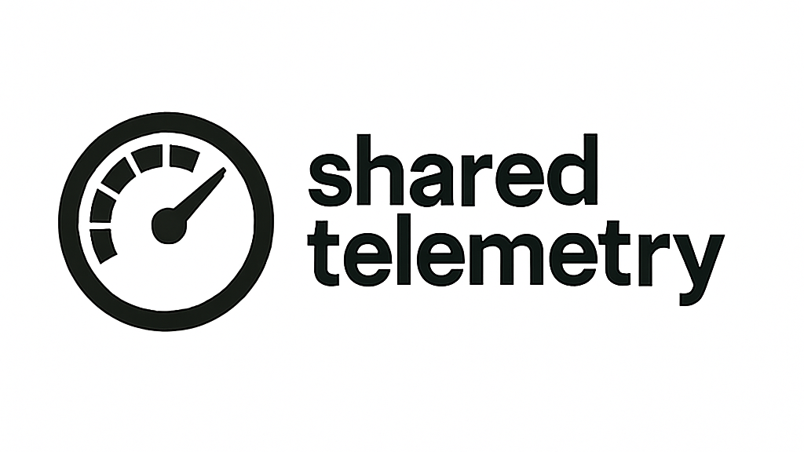

# SharedTelemetry iRacing Scraper

**SharedTelemetry** is a project with the goal of creating an ecosystem of useful tools for managing teams and events on the major simracing simulators.

This project is very young and started as a personal experiment, so initially there will be sporadic updates and a lot of confusion.

This repository contains the code to scrape iRacing data from their API and store it in a database, which is then used by other projects to display results and statistics.

## 🏗️ Architecture overview

The architectural cornerstones for this project are:

- overengineering
- highly varied technologies
- chaos

Why? Because this project is about learning new things, so it is useful to complicate life.

> Note: Some scrapers are triggered by cron jobs, while others are triggered by Pub/Sub events. The connection between the scrapers will be documented in the future.

### 📦 Tech Stack

| Layer                     | Tech                  |
| ------------------------- | --------------------- |
| Scrapers                  | GoLang                |
| Database                  | Firestore (it's free) |
| Hosting                   | Google Cloud          |
| Infrastructure management | Terraform             |

### 🔧 Structure

In the `apps` directory, you will find the scrapers that collect data from iRacing and store it in Firestore. Each folder contains a separate scraper for different data types, such as sessions, laps, and drivers.

## 📌 Status

This project is currently in **production** and actively used, primarily by [simracingleague.it](https://simracingleague.it) for national-level championship qualifications. Its current state is **stable and sufficient** for its intended use.

Future improvements are planned, including:

- Storing more information about drivers and official competitions
- Implementing a management interface for cron jobs and scrapers
- Enabling all the scrapers in production

However, this is **not a high-priority project** at the moment, and development will progress **slowly and as needed**.

## 🧰 Scrapers

The scrapers are located in the `apps` directory. Each scraper is responsible for collecting specific data from iRacing and storing it in Firestore.

Available scrapers include:

- `cars`: collects information about cars and car classes available in iRacing.
- `drivers`: collects information about iRacing's drivers. ⚠️ This scraper is not yet in production due to its high data volume.
- `leagues`: signals to the queue which leagues and seasons to scrape.
- `season`: collects information about each season of each league.
- `sessions`: collects information about single sessions as requested by the `season` scraper.

## 🛠️ Next steps

- Linting, formatting and testing the code.
- Pipelines and git hooks to ensure code quality.

## 🤝 Contributing

Contributions are welcome! Please open an issue or submit a pull request.

## 📄 License

GNU GPLv3.
